# Developer Guide

---

## Table of Contents

---

[1. Introduction](#1-introduction)  
[2. Setup Guide](#2-setup-guide)  
&nbsp;&nbsp;[2.1 Prerequisites](#21-prerequisites)  
[3. Design](#3-design)  
&nbsp;&nbsp;[3.1 Architecture](#31-architecture)  
&nbsp;&nbsp;[3.2 Parser Class](#32-parser-class)  
&nbsp;&nbsp;[3.3 UI Class](#33-ui-class)  
&nbsp;&nbsp;[3.4 Command Class](#34-command-class)  
&nbsp;&nbsp;[3.5 Validator Classes](#35-validator-classes)  
&nbsp;&nbsp;[3.6 Expense and Income Class](#36-expense-expensemanager-income-and-incomemanager-class)  
[4. Implementation](#4-implementation)  
&nbsp;&nbsp;[4.1 Expense Features](#41-expense-features)  
&nbsp;&nbsp;&nbsp;[4.1.1 Add Expense](#411-add-expense-feature)  
&nbsp;&nbsp;&nbsp;[4.1.2 Delete Expense](#412-delete-expense-feature)  
&nbsp;&nbsp;&nbsp;[4.1.3 Search Expense](#413-search-expense-feature)  
&nbsp;&nbsp;&nbsp;[4.1.4 Breakdown Expenses](#414-breakdown-expense-feature)  
&nbsp;&nbsp;&nbsp;[4.1.5 Display Monthly Expenses](#415-display-monthly-expenses)  
&nbsp;&nbsp;&nbsp;[4.1.6 Display Expenses for Month with Categories](#416-display-expenses-for-month-with-categories)  
&nbsp;&nbsp;&nbsp;[4.1.7 List Expense](#417-list-expenses-feature)  
&nbsp;&nbsp;&nbsp;[4.1.8 Edit Expense](#418-edit-expense-feature)  
&nbsp;&nbsp;[4.2 Income Features](#42-income-features)  
&nbsp;&nbsp;&nbsp;[4.2.1 Add Income](#421-add-income-feature)  
&nbsp;&nbsp;&nbsp;[4.2.2 Delete Income](#422-delete-income-feature)  
&nbsp;&nbsp;&nbsp;[4.2.3 List Expense](#423-list-income-feature)  
&nbsp;&nbsp;&nbsp;[4.2.4 Edit Expense](#424-edit-income-feature)  
&nbsp;&nbsp;[4.3 Budget Features](#43-budget-features)  
&nbsp;&nbsp;&nbsp;[4.3.1 Add Budget](#431-add-budget-feature)  
&nbsp;&nbsp;&nbsp;[4.3.2 Deduct Budget](#432-deduct-budget-feature)  
&nbsp;&nbsp;&nbsp;[4.3.3 List Budget](#433-list-budget-feature)  
&nbsp;&nbsp;&nbsp;[4.3.4 List Remaining Budget](#434-list-remaining-budget-feature)  
&nbsp;&nbsp;[4.4 Savings Features](#44-savings-features)  
&nbsp;&nbsp;&nbsp;[4.4.1 Display Savings](#441-display-savings-feature)  
&nbsp;&nbsp;[4.5 Income Spent Features](#45-income-spent-features)  
&nbsp;&nbsp;&nbsp;[4.5.1 Display Income Spent](#451-display-income-spent-feature)  
&nbsp;&nbsp;[4.6 Miscellaneous Features](#46-miscellaneous-features)  
&nbsp;&nbsp;&nbsp;[4.6.1 Display Help](#461-display-help-feature)  
[5. Appendix](#5-appendix)  
&nbsp;&nbsp;[5.1 Product Scope](#51-product-scope)  
&nbsp;&nbsp;[5.2 User Stories](#52-user-stories)  
&nbsp;&nbsp;[5.3 Non-Functional Requirements](#53-non-functional-requirements)  
&nbsp;&nbsp;[5.4 Glossary](#54-glossary)  
&nbsp;&nbsp;[5.5 Instruction for Manual Testing](#55-instructions-for-manual-testing)  

## Acknowledgements

---

All UML diagrams within the Developer Guide have been created on [Draw.io](https://draw.io/)

## 1. Introduction

---

BudgetBuddy is a CLI-based expense, income and budget tracking application. BudgetBuddy is designed to help users 
manage and monitor their daily and monthly expenses. The system tracks various categories of expenses and allows users 
to receive insights on their budget and spending patterns.

## 2. Setup Guide

---

This section describes how to setup the coding environment, along with the tools needed to work on BudgetBuddy

### 2.1 Prerequisites
1. JDK 17
2. Any working IDE that supports Java (Intellij IDEA preferred)

## 3. Design

---

### 3.1 Architecture
The following activity diagram shows the rough overview of BudgetBuddy

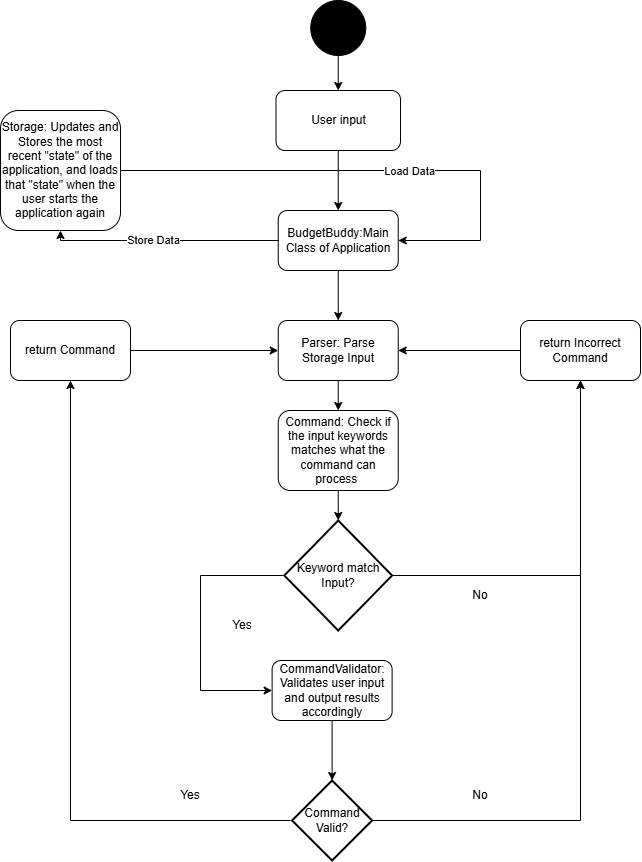

`BudgetBuddy` is the main class of application which the user can interact with directly.  The input from the user is 
processed by the main class and passed to the `Parser`. `Parser` will check for any valid keywords in the input using 
the `isCommand` method of all the `Command` object. Once the keywords are present, it will pass the input to a 
`Validator` object which validates the command on its formatting and details. Depending on the result of the `Validator`
, the command will be executed in `BudgetBuddy`. The `Validator` and `Object` genre classes utilizes methods and classes
present in the transaction folder.

### 3.2 Parser Class
The `Parser` class is to mainly determine whether the user input is valid, and proceed to process the command after.
It uses Boolean Methods to determine the presence of keywords, and then creates a Validator class to process the command
should the keywords be present.

The following are some examples:

| Boolean Methods                          | Check if input starts with | Feature Requires | 
|------------------------------------------|----------------------------|------------------|
| `ListMonthlyExpensesCommand.isCommand()` | list monthly expenses      | input            |
| `AddExpenseCommand.isCommand()`          | add expense                | input            |  

The Parser class is also used to parse lines from the `Storage` .txt file and loads it into the main application upon
restart. This will be covered more under the storage class.

### 3.3 UI Class

The UI Class is to print out elements of the app in the CLI. It contains many methods used to print general, often-used
messages such as displayWelcomeMessage() and displayExitMessage().

### 3.4 Command Class

The `Command` class is a parent class which is responsible for checking for input keywords. It has multiple subclasses,
which corresponds to a specific function of the application. Each of its subclass checks for specific keywords in the
user input. If the input is valid as checked by the `isCommand()` method, it will call its corresponding validator.

### 3.5 Validator Classes

The Validator classes are a group of classes which is responsible for further checks on input, such as whether it has
the right formatting and contains all necessary details. It will return different subclasses of the command object
depending on whether the input is valid or not. Once the object is instantiated and returned, the `main` class will call
`execute` to execute the feature.

The following sequence diagram shows the process of what happens when a user input is passed through the application,
until it gets executed.

**Note**: 
1. Validator class is not a parent class, but we have grouped it under validators to prevent cluttering of 
the diagrams. 
2. Validator also returns different type of Command Classes depending on the validity of input, which has been omitted
for the same reason as above.

#### 3.5.1 Edit Validator Classes

The Edit Validator classes are specialised for EditIncome and EditExpense commands as they take in 2 sets of input from 
the user. This first set of input command follows validators classes at [3.5 Validator Classes](#35-validator-classes). 
Upon calling of execution of command, a second set of input will be retrieved from the user, where it checks if the second 
set of inputs are valid, and it returns a `boolean` object based on the second input validity. 

The following sequence diagram shows the process of what happens from the function call of `execute()` from main until 
the return of `boolean` object from validator class.

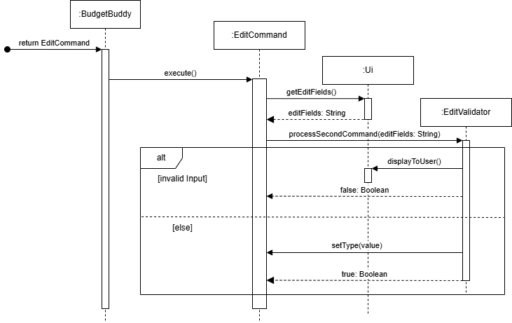

### 3.6 Expense, ExpenseManager, Income and IncomeManager Class
The `Expense` and `Income` class inherits from the Transaction class.

`Expense` class stores one expense record given by the user.

`ExpenseManager` class stores a list of `Expense`.

`Income` class stores one income record given by the user.

`IncomeManager` class stores a list of `Income`.

The methods are not shown.

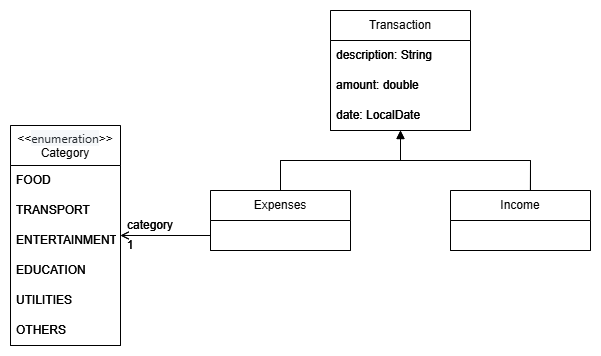

## 4. Implementation

---
### 4.1 Expense Features

#### 4.1.1 Add Expense Feature
The Add Expense feature enables users to add expenses for different categories. This functionality is controlled by the
AddExpenseCommand class, which is produced by the Parser class based on user input. The AddExpenseCommand class uses an
AddExpenseValidator class to validate the provided description, amount, category, and date, and then create and add the
given information to `AddExpenseCommand` if valid. Below is the relevance of these attributes:

| Class Attribute | Variable Type | Relevance                            |
|-----------------|---------------|--------------------------------------|
| description     | String        | The short description of the expense |
| amount          | double        | The expense amount to be added       |
| category        | Category      | The category of expense to be added  |
| date            | LocalDate     | The date of the expense              |

The BudgetBuddy class then calls the `execute()` method of the `AddExpenseCommand` object which uses the following
method in the `ExpenseManager` class to add the expense:

| Method              | Return Type | Relevance                                 |
|---------------------|-------------|-------------------------------------------|
| `addExpense(expense)` | void        | Add new expense to the list of `expenses` |                                 

A `RemainingBudgetManager` object will be created to find the budget remaining for the given month and category.
Finally, the acknowledgement message along with the budget remaining is displayed to the user using the `Ui` class
`displayToUser()` method.

The following UML Sequence diagram shows the Add Expense Feature.
We assume that the `AddExpenseCommand` has already been created and returned to `BudgetBuddy`.
The starting arrow indicates return of the command based on the sequence diagram at 
[3.5 Validator Classes](#35-validator-classes).

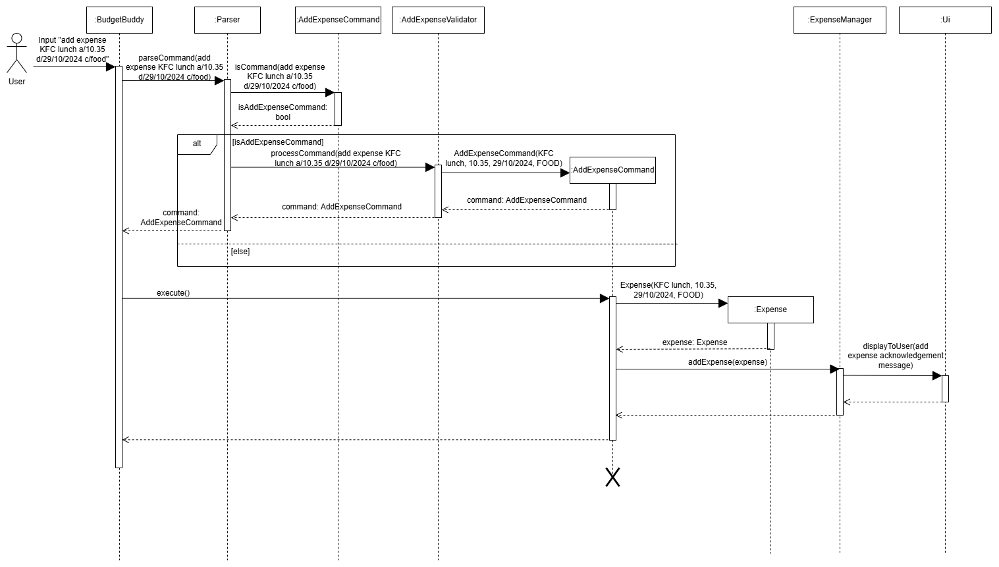

#### 4.1.2 Delete Expense Feature
The Delete Expense feature enables users to delete expense in the list of expenses. This functionality is controlled by 
the DeleteExpenseCommand class, which is produced by the Parser class based on user input. The DeleteExpenseCommand 
class uses DeleteExpenseValidator validate the provided index is valid and within the number of expenses. Next, the 
index will be stored in the newly created `DeleteExpenseCommand`. Below is the relevance of these attributes:

| Class Attribute | Variable Type | Relevance                      |
|-----------------|---------------|--------------------------------|
| index           | int           | index of the expense to delete |

The BudgetBuddy class then calls the `execute()` method of the `DeleteExpenseCommand` object which uses the following
method in the `ExpenseManager` class to add the expense:

| Method               | Return Type | Relevance                                        |
|----------------------|-------------|--------------------------------------------------|
| `deleteExpense(index)` | void        | Delete given expense from the list of `expenses` |                                 

A `RemainingBudgetManager` object will be created to find the budget remaining for the given month and category.
Finally, the acknowledgement message along with the budget remaining is displayed to the user using the `Ui` class
`displayToUser()` method.

The following UML Sequence diagram shows the Delete Expense Feature.
We assume that the `DeleteExpenseCommand` has already been created and returned to `BudgetBuddy`.
The starting arrow indicates return of the command based on the sequence diagram at 
[3.5 Validator Classes](#35-validator-classes).

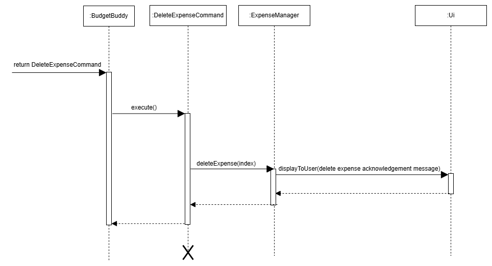

#### 4.1.3 Search Expense Feature
The Search Expense Feature enables users to search for specific expenses based on a description provided by the
user. This feature is managed by the `SearchExpensesCommand` class, initialized by the `Parser` class, with the help
of a helper class `SearchExpenseValidator` to validate and extract the user description.
The `SearchExpensesCommand` object is then created with the keyword as an attribute. The class attributes and their
relevance is as follows:

|Variable Name| Variable Type | Relevance |
|-------------|---------------|-----------|
|keyword| String | Description to find in expenses|

The BudgetBuddy class then calls the `execute()` method of the `SearchExpenseCommand` object which uses the
`searchExpenses()` method in the `ExpenseManager` class, displaying the result to the user using the `Ui` class
`displayToUser()` method.

Below is a sequence diagram representing the execution of the Search Expense interaction.
We assume that the `SearchExpenseCommand` has already been created and returned to `BudgetBuddy`.
The starting arrow indicates return of the command based on the sequence diagram at 
[3.5 Validator Classes](#35-validator-classes).

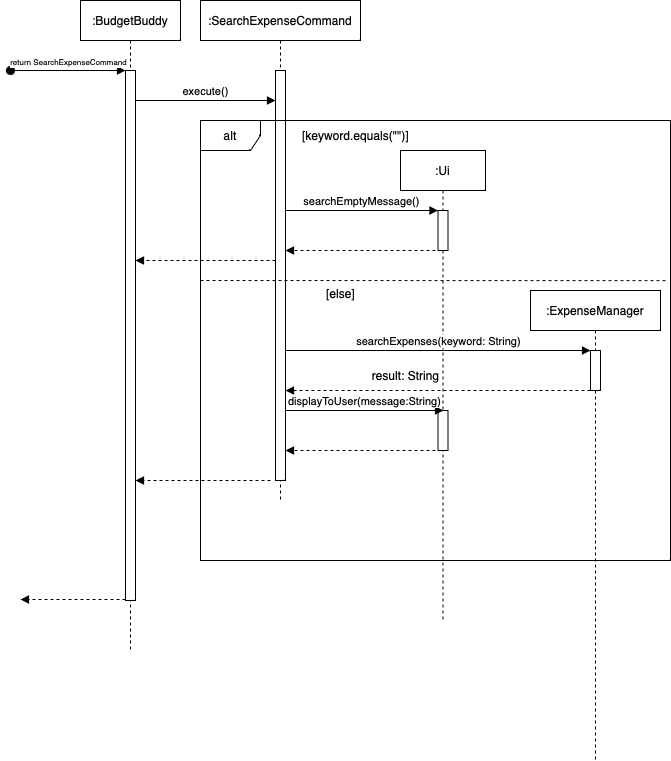

Process Overview:
1. The user issues a command to search for a specific expense i.e. `search expense Japan`. BudgetBuddy parses this
   input with the help of the `Parser` class.
2. The `Parser` calls the `isCommand()` method of the `SearchExpenseCommand` class, to check if the user input
   starts with "search expense".
3. If the user input starts with "search expense", the `Parser` then calls the `processCommand()` method of
   a helper class, `SearchExpenseValidator` to extract the description to be filtered on.
4. The `processCommand()` method above returns a new `SearchExpenseCommand` object initialized with the description
   extracted as the `keyword` attribute.
5. BudgetBuddy then calls the `execute()` method of the `SearchExpenseCommand` object.
6. If the keyword attribute is an empty string, the `SearchExpenseCommand` object calls the `searchEmptyMessage()`
   method of the `Ui` class, displaying an error message to the user that no descriptor was provided.
7. Else, the `SearchExpenseCommand` object calls the `searchExpenses()` method of the `ExpenseManager` class,
   filtering the `expenses` ArrayList and returning a String containing all expenses with the given descriptor
   in the description of the expenses. The `SearchExpenseCommand` object then calls the `displayToUser()` method in `Ui`,
   displaying this String to the user.

#### 4.1.4 Breakdown Expense Feature
The Breakdown Expense Feature allows users to gain greater insights into their expense history. The feature
makes use of the user's expense history, breaking down their total expense into the different categories, displaying
this result to the user. This allows the user to know where they are spending their money. This feature differs from
the List Expense Feature in that this feature gives a quick overview of a user's expenditure, in terms of categories.

This feature is managed by the `BreakdownExpensesCommand` class, initialized by the `Parser` class upon user input. The
`BudgetBuddy` class then calls the `execute()` method of the `BreakdownExpensesCommand` object, which uses the
`breakdownExpensesByCategory()` method in the `ExpenseManager` class to execute the functionality, displaying
the result via the `displayToUser()` method in the `Ui` class.

Below is the sequence diagram for the execution of the Breakdown Expense Feature interaction.
We assume that the `BreakdownExpensesCommand` has already been created and returned to `BudgetBuddy`.
The starting arrow indicates return of the command based on the sequence diagram at 
[3.5 Validator Classes](#35-validator-classes).

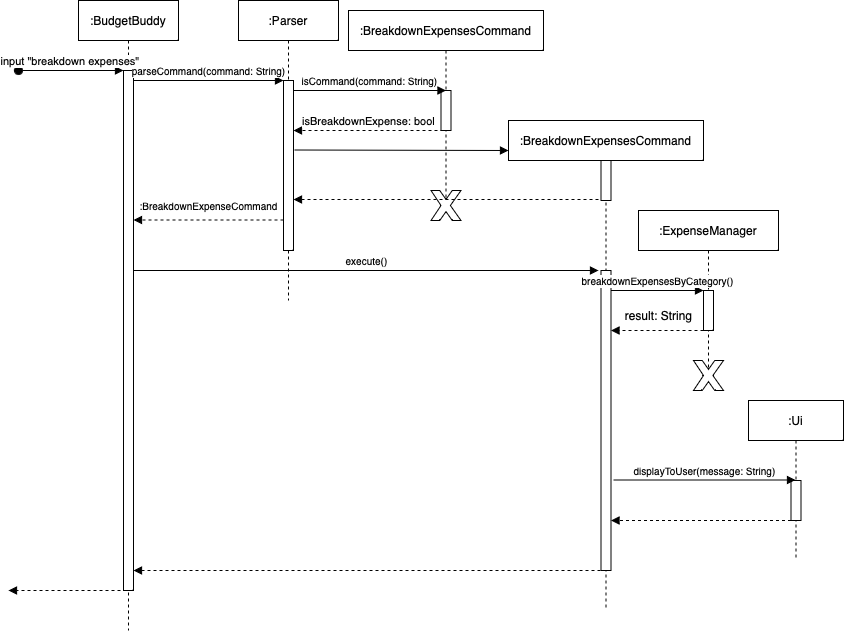

#### 4.1.5 Display Monthly Expenses
The Display Monthly Expenses feature displays an XY-Chart which helps shows user's monthly expenses across the specified
year. This functionality is controlled by the `DisplayTotalExpensesCommand` class which uses
`DisplayTotalExpensesValidator` class to validate the command string and year, and performs the deduction if valid.
Below shows the relevance of the attribute:

| Class Attribute | Variable Type | Relevance                                        |
|-----------------|---------------|--------------------------------------------------|
| year            | int           | The specified year of the chart to be displayed  |

The `BudgetBuddy` class then calls `execute()` method of `DisplayTotalExpensesCommand` object which uses the
`displayExpensesOverMonthGraph(int year)` method in `ExpenseManager` class to display the chart.

The following methods in `ExpenseOverMonthGraph` class is called by `displayExpensesOverMonth(int year)` method to
display the chart from XChart.

| Method                                                             | Return Type              | Relevance                                                                                                         |
|--------------------------------------------------------------------|--------------------------|-------------------------------------------------------------------------------------------------------------------| 
| `monthMapBuilder(ArrayList<Expense> expense)`                      | `Map<YearMonth, Double>` | Builds a Hashmap of with each key being months and each value being the total expenses of the corresponding month |
| `chartPrinter(Map<YearMonth, Double> monthlyExpenseMap, int year)` | `void`                   | Prints the XY-Chart of the specified year                                                                         |

Finally, the XChart library will be called to build the chart and display it with SwingWrapper.

The following UML Sequence diagram shows how the command is executed for this feature.  
We assume that the command for this feature has already been created and returned to `BudgetBuddy`.  
The starting arrow indicates return of the command based on the sequence diagram at 
[3.5 Validator Classes](#35-validator-classes).

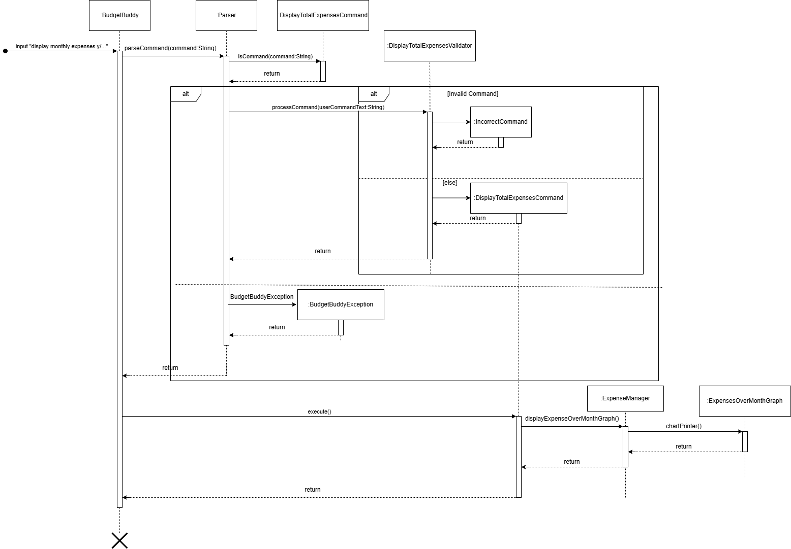

#### 4.1.6 Display Expenses for Month with Categories
The Display Expenses for Month with Categories displays a pie chart which helps shows user's expenses weightage for each
category for the specified month. This functionality is controlled by
`DisplayExpensesForMonthWithCategoriesGraphCommand` class which uses the
`DisplayExpensesForMonthWithCategoriesGraphValidator` class to validate the command string and date in YearMonth format,
and performs the deduction if valid. Below shows the relevance of the attribute.

| Class Attribute | Variable Type | Relevance                                                 |
|-----------------|---------------|-----------------------------------------------------------|
| yearMonth       | YearMonth     | The specified year and month of the chart to be displayed |

The `BudgetBuddy` class then calls `execute()` method of `DisplayExpensesForMonthWithCategoriesGraphCommand` object
which uses the `displayExpensesForMonthWithCategoriesGraph(YearMonth yearMonth)` method in `ExpenseManager` class to
display the chart.

The following methods in `ExpensesCategoryPieChart` class is called by
`displayExpensesForMonthWithCategoriesGraph(YearMonth yearMonth)` method to display the chart from XChart.

| Method                                                                                                | Return Type             | Relevance                                                                                  |
|-------------------------------------------------------------------------------------------------------|-------------------------|--------------------------------------------------------------------------------------------|
| `expensesByCategoryMapBuilder(YearMonth yearMonth)`                                                   | `Map<Category, Double>` | Builds a Hashmap with key being category and value is the total expenses for each category |
| `getTotalExpensesForMonthWithCategories(YearMonth yearMonth, Category category)`                      | `double`                | Helps to calculate the total expenses for the specified month given a category             |
| `displayExpenseByCategoryPieChart(YearMonth yearMonth, Map<Category, Double> expensesByCategoryMap)`  | `void`                  | Prints the Pie Chart of the specified month and year                                       |

Finally, the XChart library will be called to build the chart and display it with SwingWrapper.

The following UML Sequence diagram shows how the command is executed for this feature.  
We assume that the command for this feature has already been created and returned to `BudgetBuddy`.  
The starting arrow indicates return of the command based on the sequence diagram at 
[3.5 Validator Classes](#35-validator-classes).

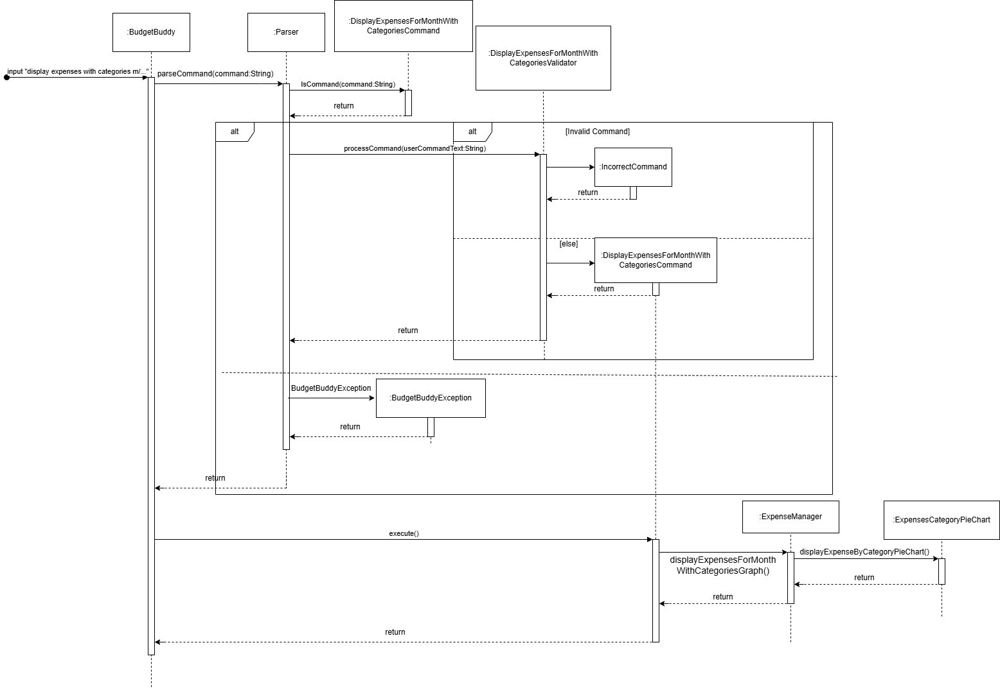

#### 4.1.7 List Expenses Feature
The List Expense feature enables users to view saved expenses in the application. Additionally, user may add additional
filters to display only desired categories and months. The total expense amount based on the displayed expenses will be
summed and displayed to the user. This feature is controlled by the `ListExpenseCommand` class, where it is initialized
by the `Parser` class. The `Parser` class uses `ListExpenseValidator` to check and extract the filter field that
the user input. The `ListExpenseCommand` object is then created with a Category and YearMonth Attribute.

| Class Attribute | Variable Type | Relevance                                            |
|-----------------|---------------|------------------------------------------------------|
| category        | Category      | The category of expenses to be listed                |
| month           | YearMonth     | The specific month and year of expenses to be listed |

The `BudgetBuddy` class then calls the `execute()` method of `ListExpenseCommand` object which uses the following
methods in `ExpenseManager` class to list expenses based on user input category and month. If user does not specify a
specific month or category, it will show every valid expense instead.

| Method                                 | Return Type | Relevance                                                    |
|----------------------------------------|-------------|--------------------------------------------------------------|
| `listExpenses()`                         | void        | Lists out all expenses saved                                 |
| `listExpensesWithCategory(category)`     | String      | Lists out all expenses saved with the specified category     |
| `listExpensesWithDate(month)`            | String      | Lists out all expenses saved in specified month              |
| `listExpensesWithCategoryAndDate(month)` | String      | Lists out all expenses saved in specified month and category |

Then, with the variations of `listExpenses()` commands in `ExpenseManager`, the list of expenses will be displayed to
the user using the `Ui` class `displayToUser()` method.

We assume that the command for this feature has already been created and returned to `BudgetBuddy`.
The starting arrow indicates return of the command based on the sequence diagram at 
[3.5 Validator Classes](#35-validator-classes).

The following UML Sequence diagram shows how the List Expense Feature undergo its execute function.
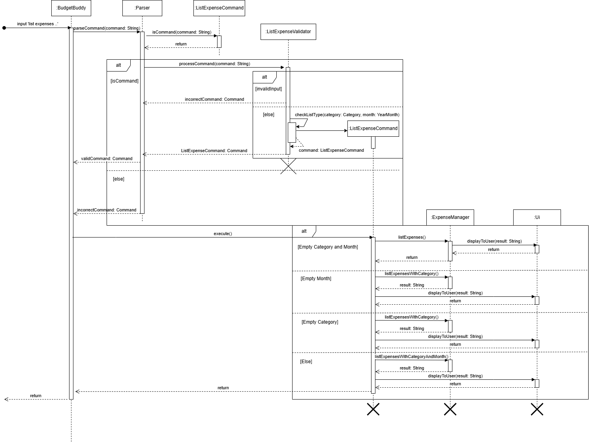

#### 4.1.8 Edit Expense Feature
The Edit Expense Feature enable users to edit pre-existing entries of expenses in the application. Users are only
allowed to change the date, category and amount fields of the expense field. Currently, the description of each task
cannot be edited, however it may be implemented for future versions. There are 2 sets of instruction that the user
has to input. The first set is to identify which expense to edit, while the second is the fields to be edited.
This feature is controlled by the `EditExpenseCommand` class, where it is initialized by the `Parser` class. The 
`Parser` class uses `EditExpenseValidator` to check and extract the `Expense` object based on index that the user input. 
`EditExpenseCommand` is then created with the extracted `Expense` object.

`EditExpenseCommand` class contains the following attributes, which will be used to store the values that will replace
the existing value in the Expense object. During the creation of `EditExpenseCommand`, only `expense` object will be
saved, while the other values will be initialized during subsequent function calls.

| Class Attribute | Variable Type | Relevance                                                              |
|-----------------|---------------|------------------------------------------------------------------------|
| category        | Category      | User input category value to replace current category value in expense |
| date            | LocalDate     | User input date value to replace current date value in expense         |
| amount          | double        | User input amount value to replace current amount value in expense     |
| expense         | Expense       | User specified Expense based on index                                  |

The `BudgetBuddy` class then calls the `execute()` method of `EditExpenseCommand` object which the `EditExpenseCommand`
class then uses the `Ui` class to call function `getUserEditFields()` for editing the expense parameters. The
`EditExpenseCommand` then uses `EditExpenseValidator` to check and extract for any valid fields. If valid, a
`processEdit()` function will be called to update values in the expense object.

The following UML Sequence diagram extends froms [3.5.1 EditValidator Classes](#351-edit-validator-classes), where it 
shows how the EditExpenseCommand updates the `Expenses(TransactionType)` object after validating second user input.

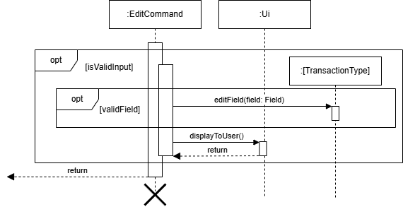

### 4.2 Income Features

#### 4.2.1 Add Income Feature
The Add Income feature enables users to add incomes. This functionality is controlled by the
AddIncomeCommand class, which is produced by the Parser class based on user input. The AddIncomeCommand class uses an
AddIncomeValidator class to validate the provided description, amount, and date, and then create and add the
given information to `AddIncomeCommand` if valid. Below is the relevance of these attributes:

| Class Attribute | Variable Type | Relevance                            |
|-----------------|---------------|--------------------------------------|
| description     | String        | The short description of the expense |
| amount          | double        | The expense amount to be added       |
| date            | LocalDate     | The date of the expense              |

The BudgetBuddy class then calls the `execute()` method of the `AddIncomeCommand` object which uses the following
method in the `IncomeManager` class to add the income:

| Method            | Return Type | Relevance                               |
|-------------------|-------------|-----------------------------------------|
| `addIncome(income)` | void        | Add new income to the list of `incomes` |                                 

The acknowledgement message is displayed to the user using the `Ui` class `displayToUser()` method.

The UML Sequence diagram is not shown because it is very similar to the [Add Expense Feature](#411-add-expense-feature).

#### 4.2.2 Delete Income Feature
The Delete Income feature enables users to delete income in the list of incomes. This functionality is controlled by
the DeleteIncomeCommand class, which is produced by the Parser class based on user input. The DeleteIncomeCommand
class uses DeleteIncomeValidator validate the provided index is valid and within the number of incomes. Next, the
index will be stored in the newly created `DeleteIncomeCommand`. Below is the relevance of these attributes:

| Class Attribute | Variable Type | Relevance                     |
|-----------------|---------------|-------------------------------|
| index           | int           | index of the income to delete |

The BudgetBuddy class then calls the `execute()` method of the `DeleteIncomeCommand` object which uses the following
method in the `IncomeManager` class to add the expense:

| Method              | Return Type | Relevance                                      |
|---------------------|-------------|------------------------------------------------|
| `deleteIncome(index)` | void        | Delete given income from the list of `incomes` |                                 

The acknowledgement message is displayed to the user using the `Ui` class `displayToUser()` method.

The UML Sequence diagram is not shown because it is very similar to the [Add Income Feature](#412-delete-expense-feature).

#### 4.2.3 List Income Feature
The List Income feature enables users to view saved income in the application. Additionally, user may add additional
filters to display only desired months. The total income amount based on the displayed income will be summed and
displayed to the user. This feature is controlled by the `ListIncomeCommand` class, where it is initialized by the
`Parser` class. The `Parser` class uses `ListIncomeValidator` to check and extract the filter field that the user
input. The `ListIncomeCommand` object is then created with a Category and YearMonth Attribute.

| Class Attribute | Variable Type | Relevance                                            |
|-----------------|---------------|------------------------------------------------------|
| month           | YearMonth     | The specific month and year of expenses to be listed |

The `BudgetBuddy` class then calls the `execute()` method of `ListIncomeCommand` object which uses the following
methods in `IncomeManager` class to list expenses based on user input category and month. If user does not specify a
specific month, it will show every valid expense instead.

| Method                      | Return Type | Relevance                                                    |
|-----------------------------|-------------|--------------------------------------------------------------|
| `listIncomes()`               | void        | Lists out all expenses saved                                 |
| `listIncomesWithMonth(month)` | String      | Lists out all expenses saved in specified month              |

Then, with the variations of `listIncomes()` commands in `IncomeManager`, the list of incomes will be displayed to
the user using the `Ui` class `displayToUser()` method.

We assume that the command for this feature has already been created and returned to `BudgetBuddy`.
The starting arrow indicates return of the command based on the sequence diagram at 
[3.5 Validator Classes](#35-validator-classes).

The following UML Sequence diagram shows how the List Income Feature undergo its execute function.

#### 4.2.4 Edit Income Feature
The Edit Income Feature enable users to edit pre-existing entries of incomes in the application. Users are only
allowed to change the date and amount fields of the income field. Currently, the description of each task
cannot be edited, however it may be implemented for future versions. There are 2 sets of instruction that the user
has to input. The first set is to identify which expense to edit, while the second is the fields to be edited.
This feature is controlled by the `EditIncomeCommand` class, where it is initialized by the `Parser` class. The
`Parser` class uses `EditIncomeValidator` to check and extract the `Income` object based on index that the user input.
`EditExpenseCommand` is then created with the extracted `Income` object.

`EditIncomeCommand` class contains the following attributes, which will be used to store the values that will replace
the existing value in the Income object. During the creation of `EditIncomeCommand`, only `Income` object will be
saved, while the other values will be initialized during subsequent function calls.

| Class Attribute | Variable Type | Relevance                                                              |
|-----------------|---------------|------------------------------------------------------------------------| 
| date            | LocalDate     | User input date value to replace current date value in expense         |
| amount          | double        | User input amount value to replace current amount value in expense     |
| income          | Income        | User specified Income based on index                                   |

The `BudgetBuddy` class then calls the `execute()` method of `EditIncomeCommand` object which the `EditIncomeCommand`
class then uses the `Ui` class to call function `getUserEditFields()` for editing the expense parameters. The
`EditIncomeCommand` then uses `EditIncomeValidator` to check and extract for any valid fields. If valid, a
`processEdit()` function will be called to update values in the Income object.

The UML sequence diagram follows similarly to `Edit Expenses` feature at [4.1.8 Edit Expenses Feature](#418-edit-expense-feature),
where it has one less category field to edit compared to `Edit Expenses`. 

### 4.3 Budget Features

#### 4.3.1 Add Budget Feature
The Add Budget feature enables users to add budgets for different categories. This functionality is controlled by the
AddBudgetCommand class, which is produced by the Parser class based on user input. The AddBudgetCommand class uses an
AddBudgetValidator object to validate the provided amount, category, and date, and then performs the budget addition
if valid. Below is the relevance of these attributes:

| Class Attribute | Variable Type | Relevance                                   |
|-----------------|---------------|---------------------------------------------|
| amount          | double        | The budget amount to be added               |
| category        | Category      | The category of budget to be added          |
| date            | YearMonth     | The specific month and year of budget added |

The BudgetBuddy class then calls the `execute()` method of the `AddBudgetCommand` object which uses the following
method in the `BudgetManager` class to add a new budget created by the `Budget` class to the `budgets` list
if it does not exist:

| Method            | Return Type | Relevance                               |
|-------------------|-------------|-----------------------------------------|
| `addBudget(budget)` | void        | Add new budget to the list of `budgets` |                                 

Then, `addAmount(category, amount)` method in the `Budget` class is also called to add the amount to the budget.
Finally, the result is displayed to the user using the `Ui` class `displayToUser()` method.

The following UML Sequence diagram shows how to obtain the relevant inputs for the Add Budget Feature:

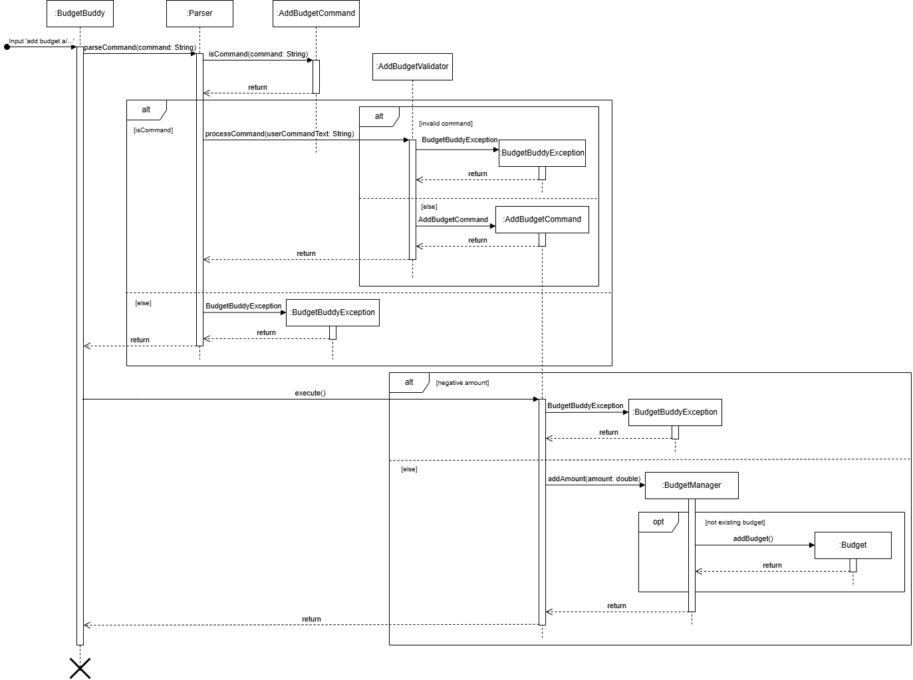

#### 4.3.2 Deduct Budget Feature
The Deduct Budget feature enables users to deduct an amount from an existing budget. This functionality is controlled
by the DeductBudgetCommand class, which is produced by the Parser class based on user input.
The DeductBudgetCommand class uses a DeductBudgetValidator object to validate the provided amount, category, and date,
checks if the specified budget exists, and then performs the deduction if valid.
Below is the relevance of these attributes:

| Class Attribute | Variable Type | Relevance                                      |
|-----------------|---------------|------------------------------------------------|
| amount          | double        | The budget amount to be deducted               |
| category        | Category      | The category of budget to be deducted          |
| date            | YearMonth     | The specific month and year of budget deducted |

The BudgetBuddy class then calls the `execute()` method of the `DeductBudgetCommand` object which uses the
`deductAmount(category, amount)` method in the `Budget` class to deduct amount from the budget.

The following method in the `BudgetManager` class called by `deductAmount(category, amount)` to delete a budget from
the `budgets` list if the total amount of the budget reaches zero:

| Method               | Return Type | Relevance                                |
|----------------------|-------------|------------------------------------------|
| `deleteBudget(amount)` | void        | Delete budget from the list of `budgets` |      

Finally, the result is displayed to the user using the `Ui` class `displayToUser()` method.

The following UML Sequence diagram shows how to obtain the relevant inputs for the Deduct Budget Feature:

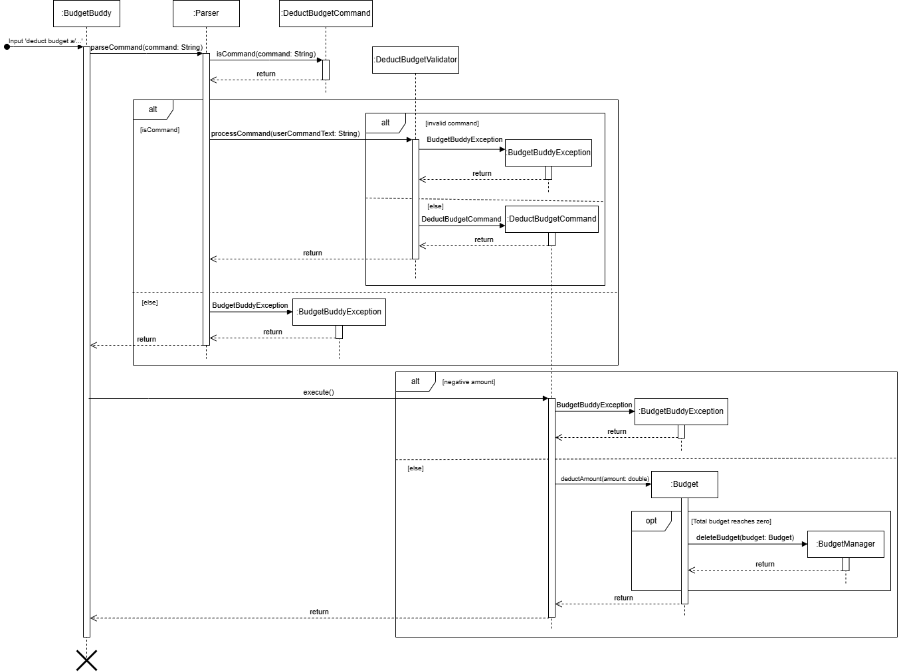

#### 4.3.3 List Budget Feature
The List Budget feature enables users to view all existing budgets or filter them based on the date. This functionality
is controlled by the ListBudgetCommand class, which is produced by the Parser class based on user input.
The ListBudgetCommand class uses a ListBudgetValidator object to validate the provided date, checks if the list request
is valid, and, if valid, retrieves and displays the matching budget through the UI. If the validation fails,
an error message is shown.

The following UML Sequence diagram shows how to obtain the relevant inputs for the List Budget Feature:

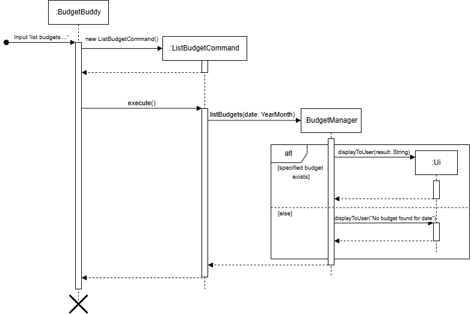

#### 4.3.4 List Remaining Budget Feature
The `ListRemainingBudgetManager` will get the `Expenses` from `ExpenseManager` and `Budgets` from `BudgetManager`. All
the `Expense` amount will be deducted from the budget according to the date and category.

The following UML Sequence diagram shows the List Remaining Budgets Feature.
We assume that the command for this feature has already been created and returned to `BudgetBuddy`.
The starting arrow indicates return of the command based on the sequence diagram at [3.5 Validator Classes](#35-validator-classes).
The loop to copy all the budget and the loop to match a expense to a budget are omitted to reduce complexity.

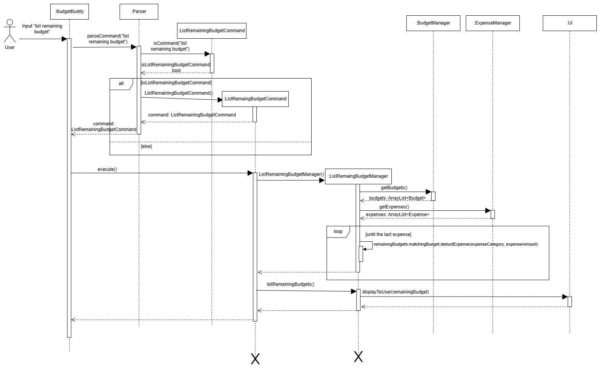

### 4.4 Savings Features

---
#### 4.4.1 Display Savings Feature
The Display Savings Feature enables users to check how much they have saved, through their inputs into the application.
We assume that the user has accurately reflected all expenses and incomes, and we calculate their savings by
taking Savings = Total Income - Total Expense. The user has the option to either
display their total savings, or their savings per month since using the app. This feature is managed by the
`DisplaySavingsCommand` class, initialized by the `Parser` class using the `DisplaySavingsValidator` class to display
the correct savings, according to the user input.
The `DisplaySavingsCommand` object is then created with a boolean as an attribute. The class attributes and their
relevance is as follows:

|Variable Name| Variable Type | Relevance                                                                   | 
|-------------|---------------|-----------------------------------------------------------------------------|
|byMonth| boolean | Indicates whether the user wants to display by month or just total savings. |

The BudgetBuddy class then calls the `execute()` method of the `DisplaySavingsCommand` object which uses the
`displaySavings()` or `displaySavingsByMonth()` method in the `SavingsManager` class, displaying the result to the
user using the `Ui` class `displayToUser()` method.

Below is a sequence diagram representing the execution of the Display Expense interaction.
We assume that the `DisplaySavingsCommand` has already been created and returned to `BudgetBuddy`.
The starting arrow indicates return of the command based on the sequence diagram at 
[3.5 Validator Classes](#35-validator-classes).

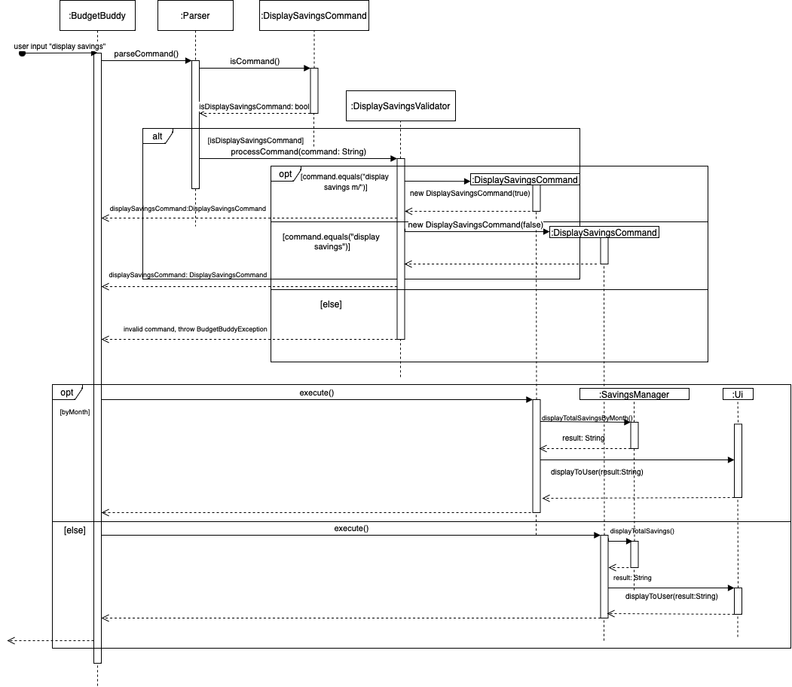

Process Overview:
1. The user issues a command to display savings i.e. `display savings m/`. BudgetBuddy parses this input with the help
   of the `Parser` class.
2. The `Parser` class calls the `isCommand()` method of the `DisplaySavingsCommand` class, to check if the user input
   starts with "display savings".
3. If the user input starts with "display savings", the `Parser` then calls the `processCommand()` method of
   `DisplaySavingsValidator` to determine if the user wants a monthly breakdown of savings or simply their total savings.
4. The `processCommand()` method above returns a new `DisplaySavingsCommand` object initialized with a `byMonth`
   attribute, set to true if the user wants a monthly breakdown of savings. Otherwise if the user just wants their total
   savings, this attribute will be set to false.
5. BudgetBuddy then calls the execute() method of the `DisplaySavingsCommand` object.
6. Depending on the `byMonth` attribute, either `displayTotalSavingsByMonth()` or `displayTotalSavings()` will be
   executed from the `SavingsManager` class.
7. The respective methods then save the results in a String, and returns this String to the `DisplaySavingsCommand`,
   which then calls the `displayToUser()` method in `Ui`, displaying this String to the user.

The class diagram below indicates the structure of the DisplaySavings Feature, involving `SavingsManager`, `Saving`,
`IncomeManager` and `ExpenseManager`.

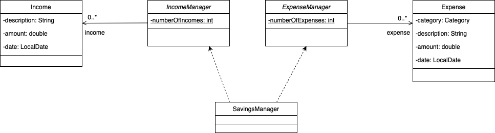

### 4.5 Income Spent Features

---
#### 4.5.1 Display Income Spent Feature
The Display Income Spent Feature shows users the percentage of income spent for a specific month. When the command is
received, BudgetBuddy creates a DisplayIncomeSpentCommand object and executes it. The command then calls
displaySpentPercentage(month) on IncomeSpent, which calculates the percentage for the specified month. The result is
formatted with toString(month: YearMonth) and passed to the Ui component via displayToUser(result: String) for display
to the user.

The following UML Sequence diagram shows how to obtain the relevant inputs for the Display Income Spent Feature:

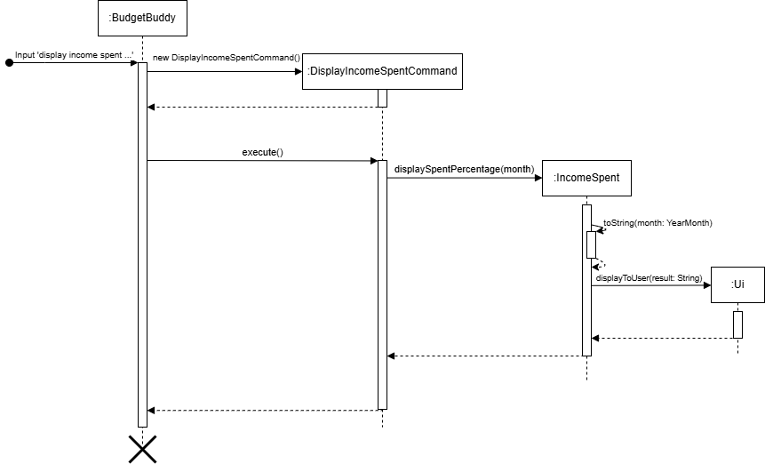

### 4.6 Miscellaneous Features

---
#### 4.6.1 Display Help Feature
The Display Help Feature serves as a guide for new users, displaying a list of features and an example command
for each feature. The feature is managed by the `HelpComand` class, initialized by the `Parser` class upon user input.
The `BudgetBuddy` class then calls the `execute()` method of the `HelpCommand` object, which uses the
`displayHelpMessage()` method of the `Ui` class.

Below is the sequence diagram for the execution of the Display Help Feature.
We assume that the `HelpCommand` has already been created and returned to `BudgetBuddy`.
The starting arrow indicates return of the command based on the sequence diagram at
[3.5 Validator Classes](#35-validator-classes).

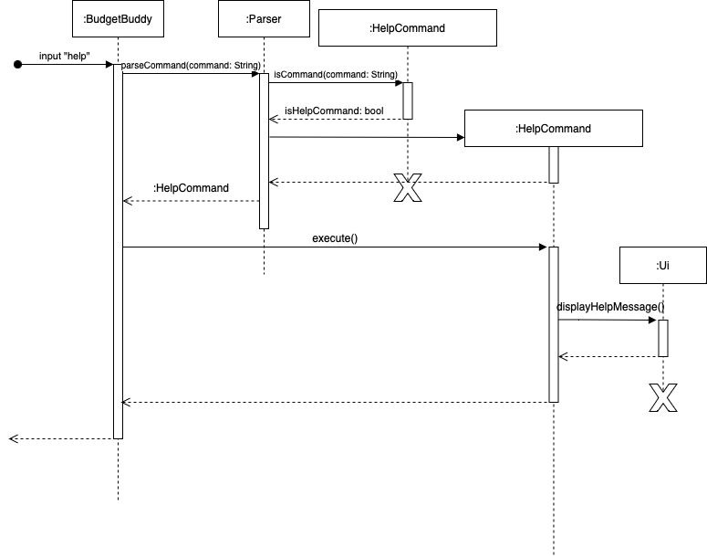

# 5. Appendix

## 5.1 Product scope
### 5.1.1 Target user profile
For people who have troubles keeping track of their finances and allow them to make more informed financial
decisions.

### 5.1.2 Value proposition
For students who have difficulties keeping track of expenses and making informed financial choices, BudgetBuddy
acts as a simple-to-use expense and income tracker, as well as a budgeting tool that provides insights into 
the user's finances. BudgetBuddy simplifies your financial management, helping you stay organised in a single 
application.

## 5.2 User Stories

| Version | As a ... | I want to ...                                       | So that I can ...                                           |
|---------|----------|-----------------------------------------------------|-------------------------------------------------------------|
| v1.0    | new user | see usage instructions                              | refer to them when I forget how to use the application      |
| v1.0    | user     | add and delete income                               | track my incomes                                            |
| v1.0    | user     | add and delete expenses                             | track my expenses                                           |
| v1.0    | user     | view a history of my past income                    | see how my income changed over time                         |
| v1.0    | user     | view a history of my past expenses                  | see how my expenses changed over time                       |
| v1.0    | user     | categorise my expenses                              | understand where my money is going                          | 
| v1.0    | user     | search for specific expense entries                 | quickly find past transactions                              |
| v1.0    | user     | add and delete Monthly Budget                       | limit my spending                                           |
| v1.0    | user     | view a history of my past budgets                   | see how my spending has changed over time                   |
| v1.0    | user     | save and load my data automatically                 | view my past entries                                        |
| v2.0    | user     | view the trends of my monthly expense               | analyse my expense pattern                                  |
| v2.0    | user     | view the total expenses for one month               | see a summary of my expenses for the month                  |
| v2.0    | user     | view my monthly savings                             | plan for future expenses                                    |
| v2.0    | user     | see where I am spending my money                    | better manage my expenses                                   |
| v2.0    | user     | set a monthly budget for each category              | track and manage my spending in different areas             |
| v2.0    | user     | view the percentage of my total income spent        | track my savings                                            |
| v2.0    | user     | find a to-do item by name                           | locate a to-do without having to go through the entire list |
| v2.0    | user     | see the budget left                                 | remember to keep to my budget                               |
| v2.0    | user     | get alerts when I am nearing or exceeding my budget | better control my spending                                  |
| v2.0    | user     | view the trends of my monthly expenses on a graph   | better visualize my spending trends                         |
| v2.0    | user     | view my total expenses for a specific month         | better track my monthly expenditure                         |
| v2.0    | user     | edit an existing expense entry                      | correct any mistakes made to an expense entry               |
| v2.0    | user     | edit an existing income entry                       | correct any mistakes made to an income entry                |

## 5.3 Non-Functional Requirements

1. The Application should work on any *mainstream OS* as long as it has java`17` or above installed.
2. A user with above average typing speed for regular English text should be able to accomplish most of the tasks faster 
using commands than using the mouse.

## 5.4 Glossary

* *Transactions* - Reference to the different money types in the application [Income, Budget, Expenses]
* *Mainstream OS* - Windows, Linux, Unix, MacOS

## 5.5 Instructions for manual testing
### 5.5.1. Launching BudgetBuddy
#### 5.5.1.1 Launch
  * Download the jar file and copy it to an empty folder.
  * Navigate to the jar file via a Terminal window. 
  * Start the jar file with the command `java -jar BudgetBuddy.jar`
  * Expected: Command Line Interface should appear with a welcome message to users, prompting the user for a command.

### 5.5.2. Test Cases

#### 5.5.2.1 Displaying command/help list. 
1. **Test Case**: `help`  
    Expected: Prints the functionalities of BudgetBuddy, along with the appropriate commands for each feature.
2. **Test Case**: `help 123`  
    Expected: Prints the functionalities of BudgetBuddy, along with the appropriate commands for each feature.

#### 5.5.2.2 Search Expense
* **2.2.1 No descriptor provided to search for.** 
  * **Prerequisites**: None
  * **Test Case**: `search expense`   
  * **Expected**: Error messsage appears informing the user to key in a valid description to search for. 

* **2.2.2 No expense entry contains given descriptor.**
    * **Prerequisites**: At least one expense entry, such that no entry contains the given 
  descriptor "notInAnyExpense" in its description.
    * **Test Case**: `search expense notInAnyExpense`  
    * **Expected**: Message telling user that no expense entry has been found with the given 
    descriptor ("notInAnyExpense").
  
* **2.2.3 Expense found with given descriptor.**
    * **Prerequisites**: At least one expense entry with description containing the given
  descriptor "Japan".
    * **Test Case**: `search expense Japan` 
    * **Expected**: Message showing users the expense entries with descriptions that include the word 
    "Japan". Filtering is case insensitive.

#### 5.5.2.3 Breakdown Expenses 
* **2.3.1 No expense added into the app.** 
    * **Prerequisites**: No expense tracked in the app. 
    * **Test Case**: `breakdown expenses`
    * **Expected**: Error message prompting user that there are no expense entries. 

* **2.3.2 Expenses added into the app.** 
    * **Prerequisites**: At least one expense entry tracked by the app.
    * **Test Case**: `breakdown expenses`
    * **Expected**: Message showing the breakdown of total expenses by category.

#### 5.5.2.4 Display Savings
* **2.4.1 Display Savings in total**
    * **Prerequisites**: At least one expense/income entry tracked by the app. 
    * **Test Case**: `display savings`
    * **Expected**: Message showing the total savings of the user based on the incomes and expenses tracked by 
    the app, as well as first expense and income entry dates.

* **2.4.2 Display Savings by month**
    * **Prerequisites**: At least one expense/income entry tracked by the app.
    * **Test Case**: `display savings m/`
    * **Expected**: Message showing the monthly breakdown of savings of the user, based on the incomes and expenses
    tracked by the app. 

* **2.4.3 No expense and income entries tracked by the app.**
    * **Prerequisites**: App is not tracking any expense or income entries. 
    * **Test Case**: `display savings m/` or `display savings`
    * **Expected**: Message showing that the user has 0 savings. 

### 5.5.2.5 Adding an Expense
* **2.5.1 Adding expense without optional fields (date and category)**
   * **Prerequisites**: None
   * **Test Case**: `add expense coffee a/5.00`
   * **Expected**: Adds an expense with default values and displays success message.

* **2.5.2 Adding expense with all fields (description, amount, date, category)**
   * **Prerequisites**: None
   * **Test Case**: `add expense air ticket a/300.00 d/01/11/2024 c/TRANSPORT`
   * **Expected**: Success message for added expense.

* **2.5.3 Adding expense with invalid date format**
   * **Prerequisites**: None
   * **Test Case**: `add expense movie ticket a/15.00 d/2024-11-01`
   * **Expected**: Error message indicating incorrect date format.

* **2.5.4 Adding expense with negative amount**
   * **Prerequisites**: None
   * **Test Case**: `add expense lunch a/-5.00`
   * **Expected**: Error message indicating amount must be positive.

### 5.5.2.6 Deleting an Expense
* **2.6.1 Deleting an expense by valid index**
   * **Prerequisites**: At least one expense entry in the app.
   * **Test Case**: `delete expense 1`
   * **Expected**: Deletes the expense and displays confirmation.

* **2.6.2 Deleting an expense by invalid index**
   * **Prerequisites**: At least one expense entry in the app.
   * **Test Case**: `delete expense 999`
   * **Expected**: Error message indicating index out of range.

* **2.6.3 Deleting an expense from an empty list**
   * **Prerequisites**: No expense entries in the app.
   * **Test Case**: `delete expense 1`
   * **Expected**: Error message indicating no expenses to delete.

### 5.5.2.7 Display Monthly Expenses Chart
* **2.7.1 Valid year provided for chart display**
   * **Prerequisites**: At least one expense entry in the specified year.
   * **Test Case**: `display monthly expenses y/2024`
   * **Expected**: XY-Chart displaying total expenses for each month.

* **2.7.2 Invalid year provided for chart display**
   * **Prerequisites**: None
   * **Test Case**: `display monthly expenses y/1899`
   * **Expected**: Error message for incorrect year.

* **2.7.3 No expenses tracked in the specified year**
   * **Prerequisites**: No expense entries for 2024.
   * **Test Case**: `display monthly expenses y/2024`
   * **Expected**: Flat XY-Chart showing 0 values for all months.

### 5.5.2.8 Listing Incomes
* **2.8.1 Listing all incomes**
   * **Prerequisites**: At least one income entry tracked.
   * **Test Case**: `list incomes`
   * **Expected**: Lists incomes and total.

* **2.8.2 Listing incomes for a specific month**
   * **Prerequisites**: At least one income entry in October 2024.
   * **Test Case**: `list incomes m/10/2024`
   * **Expected**: Lists income entries for October 2024, with total.

* **2.8.3 No incomes tracked in the app**
   * **Prerequisites**: No income entries.
   * **Test Case**: `list incomes`
   * **Expected**: Message indicating no income entries.

### 5.5.2.9 Editing Incomes
* **2.9.1 Listing all incomes**
   * **Prerequisites**: At least one income entry tracked.
   * **Test Case**: `list incomes`
   * **Expected**: Lists incomes and total.

* **2.9.2.A Edit an income from the income list (Selecting an Income)**
   * **Prerequisites**: At least one income entry in the overall income list.
   * **Test Case**: `edit income 1`
   * **Expected**: Displays the income of index 1 to the user and the available field to edit.

* **2.9.2.B Edit an income from the income list (Editing Income fields)**
   * **Prerequisites**: Selected Income is valid from previous step (2.9.2.A).
   * **Test Case**: `a/1000 d/10/12/2024`
   * **Expected**: Edits the amount and date of the income to *$1000* and *10th December 2024* respectively.

* **2.9.3 Invalid income index given by user**
   * **Prerequisites**: No income entries.
   * **Test Case**: `edit income 30`
   * **Expected**: Error message indicating invalid income index displayed.

### 5.5.2.10 Adding a Budget
* **2.10.1 Adding to a monthly budget without specifying month or category**
   * **Prerequisites**: None
   * **Test Case**: `add budget a/500`
   * **Expected**: Adds 500 to current month’s budget. Confirmation message.

* **2.10.2 Adding to a monthly budget with all fields (amount, date, category)**
   * **Prerequisites**: None
   * **Test Case**: `add budget a/500 m/09/2024 c/FOOD`
   * **Expected**: Adds 500 to September 2024 Food's budget. Confirmation message.

* **2.10.3 Adding to a monthly budget with invalid date format**
   * **Prerequisites**: None
   * **Test Case**: `add budget a/1500 m/2024-11`
   * **Expected**: Error message indicating incorrect date format.

* **2.10.4 Adding to a monthly budget with negative amount**
   * **Prerequisites**: None
   * **Test Case**: `add budget a/-500`
   * **Expected**: Error message indicating amount must be positive.

### 5.5.2.11 Deducting a Budget
* **2.11.1 Deducting a positive amount from monthly budget**
   * **Prerequisites**: Budget more than 200 in current month.
   * **Test Case**: `deduct budget a/200`
   * **Expected**: Deducts 200 and shows success message.

* **2.11.2 Deducting an amount that causes budget to go below zero**
   * **Prerequisites**: Budget less than 200 in current month.
   * **Test Case**: `deduct budget a/200`
   * **Expected**: Deducts 200 and shows success message indicating the budget has been deleted.

* **2.11.3 Deducting budget with all fields (amount, date, category)**
   * **Prerequisites**: Transport Budget more than 400 in October 2024.
   * **Test Case**: `deduct budget a/400 m/10/2024 c/TRANSPORT`
   * **Expected**: Deducts 400 from Transport Budget and shows success message.

### 5.5.2.12 Listing Budgets
* **2.12.1 Listing all budgets**
   * **Prerequisites**: At least one budget entry tracked.
   * **Test Case**: `list budgets`
   * **Expected**: Lists up to 12 latest budgets.

* **2.12.2 Listing budget for a specific month**
   * **Prerequisites**: At least one budget entry in October 2024.
   * **Test Case**: `list budgets m/10/2024`
   * **Expected**: Lists budget entry for October 2024.

* **2.12.3 No budget tracked in the app**
   * **Prerequisites**: No budget entry.
   * **Test Case**: `list budgets`
   * **Expected**: Message indicating no budget entry.

* **2.12.4 No budget tracked in the app for specified month**
   * **Prerequisites**: No budget entry for specified month.
   * **Test Case**: `list budgets m/08/2024`
   * **Expected**: Message indicating no budget entry for August 2024.

### 5.5.2.13 Display Income Spent
* **2.13.1 Display percentage of income spent without specifying month**
   * **Prerequisites**: At least one expense and one income entries tracked by the app.
   * **Test Case**: `display income spent`
   * **Expected**: Message showing the percentage of income spent by the user based on the incomes and expenses tracked by
     the app for the current month.

* **2.13.2 Display percentage of income spent of specified month**
   * **Prerequisites**: At least one expense and one income entries tracked by the app in the specified month.
   * **Test Case**: `display income spent m/11/2024`
   * **Expected**: Message showing the percentage of income spent by the user based on the incomes and expenses tracked by
     the app for November 2024.

* **2.13.3 No income entry recorded for specified month**
   * **Prerequisites**: No income entry tracked by the app in the specified month.
   * **Test Case**: `display income spent m/07/2024`
   * **Expected**: Error message showing no income is recorded for July 2024.

### 5.5.2.14 Display Expenses for the Month With Categories Chart
* **2.14.1 Valid Month provided for chart display**
  * **Prerequisites**: At least one expenses for one of the categories in the specified month and year.
  * **Test Case**: `display expenses with categories m/10/2024`
  * **Expected**: PieChart displaying expenses sliced by categories.

* **2.14.2 Invalid Format provided for chart display**
  * **Prerequisites**: None
  * **Test Case**: `display expenses with categories m/`
  * **Expected**: Error message for formatting error.

* **2.14.3 No expenses tracked in the specific month of the year**
  * **Prerequisites**: No expense entries for that particular month of the year.
  * **Test Case**: `display expenses with categories m/09/2024`
  * **Expected**: Empty PieChart shown with values on legends showing all 0.

### 5.5.2.15 Exiting BudgetBuddy
* **2.15.1 Exit command**
   * **Prerequisites**: None
   * **Test Case**: `bye`
   * **Expected**: Program exits and saves data automatically, showing exit message.

   