# User Guide

---

## Table of Contents

---

[Introduction](#introduction)  
[Quick Start](#quick-start)  
[Features](#features-)  
&nbsp;&nbsp;1. [Expense](#expense)  
&nbsp;&nbsp;&nbsp;&nbsp;&bull; [Add Expense](#1-adding-an-expense-add-expense)  
&nbsp;&nbsp;&nbsp;&nbsp;&bull; [Delete Expense](#2-deleting-an-expense-delete-expense)  
&nbsp;&nbsp;&nbsp;&nbsp;&bull; [List Expenses](#3-list-all-expenses-list-expenses)  
&nbsp;&nbsp;&nbsp;&nbsp;&bull; [Edit Expenses](#4-edit-pre-existing-expenses-edit-expenses)  
&nbsp;&nbsp;&nbsp;&nbsp;&bull; [Display Monthly Expenses Chart](#5-display-monthly-expenses-chart-display-monthly-expenses)  
&nbsp;&nbsp;&nbsp;&nbsp;&bull; [Display Expenses for the Month with Categories Chart](#6-display-expenses-for-the-month-with-categories-chart-display-expenses-with-categories)  
&nbsp;&nbsp;&nbsp;&nbsp;&bull; [Search Expense](#7-search-expense-search-expenses)  
&nbsp;&nbsp;&nbsp;&nbsp;&bull; [Breakdown Expenses](#8-breakdown-expenses-breakdown-expenses)  
&nbsp;&nbsp;2. [Income](#income)  
&nbsp;&nbsp;&nbsp;&nbsp;&bull; [Add Income](#1-adding-an-income-add-income)  
&nbsp;&nbsp;&nbsp;&nbsp;&bull; [Delete Income](#2-deleting-an-income-delete-income)  
&nbsp;&nbsp;&nbsp;&nbsp;&bull; [Edit Income](#3-edit-pre-existing-incomes-edit-incomes)  
&nbsp;&nbsp;&nbsp;&nbsp;&bull; [List Income](#4-list-all-incomes-list-incomes)  
&nbsp;&nbsp;3. [Budget](#budget)  
&nbsp;&nbsp;&nbsp;&nbsp;&bull; [Add Budget](#1-adding-a-budget-add-budget)  
&nbsp;&nbsp;&nbsp;&nbsp;&bull; [Deduct Budget](#2-deducting-a-budget-deduct-budget)  
&nbsp;&nbsp;&nbsp;&nbsp;&bull; [List Budget](#3-listing-budgets-list-budgets)  
&nbsp;&nbsp;&nbsp;&nbsp;&bull; [List Remaining Budget](#4-list-remaining-budgets-list-remaining-budget)  
&nbsp;&nbsp;4. [Saving](#saving)  
&nbsp;&nbsp;&nbsp;&nbsp;&bull; [Display Savings](#1-display-savings-display-savings-m)  
&nbsp;&nbsp;5. [Income Spent](#income-spent)  
&nbsp;&nbsp;&nbsp;&nbsp;&bull; [Display Income Spent](#1-display-income-spent-display-income-spent)  
&nbsp;&nbsp;6. [Miscellaneous](#miscellaneous)  
[User Warnings](#user-warnings)  
&nbsp;&nbsp;1. [Descriptions](#1-descriptions)  
[FAQ](#faq)  
[Command Summary](#command-summary)  

## Introduction
BudgetBuddy is a desktop application for managing finance and anything related to it, optimised for
use via a Command Line Interface (CLI)

Words in `UPPER_CASE` are the parameters to be supplied by the users.
* e.g in `list incomes [m/MONTH]`, `MONTH` is a parameter which can be used as `list incomes m/10/2024`
* Items in square brackets are optional, e.g: `list incomes` is a valid command.

Extraneous parameters for commands that do not take in parameters (such as `help`) will be ignored.
* e.g. if the command specified is `help 1234`, it will be interpreted as `help`

## Quick Start

1. Download the JAR File from our GitHub Release and put into your preferred directory.
2. Open your terminal and cd to that directory.
3. Enter `java -jar BudgetBuddy.jar` and enjoy the app!

## Features

---

### Budget

---

#### 1. Adding a budget: `add budget`
Adds an amount to the month’s current budget. Budget is cumulative for the current month.

Format: `add budget a/AMOUNT [m/MONTH] [c/CATEGORY]`

* The `AMOUNT` is the amount of the budget to be added.
* The `MONTH` (Optional) is the month of the budget in MM/YYYY format. If month is not given, current month will be used.
* The `CATEGORY` (Optional) is the category of the budget (FOOD, TRANSPORT, ENTERTAINMENT, EDUCATION, UTILITIES and OTHERS).
  The default category is OTHERS.

Examples of usages:
1. `add budget a/800`
2. `add budget a/700 m/11/2024 c/TRANSPORT`

Expected Usage of Feature:

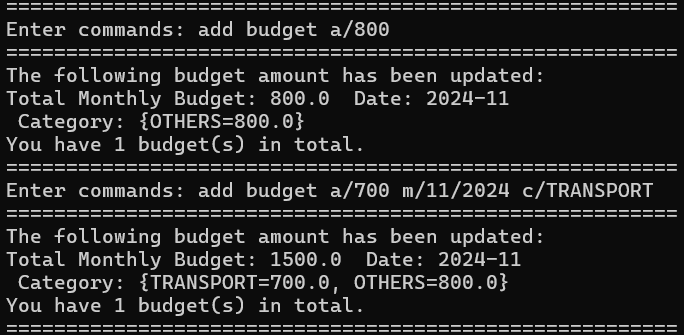

#### 2. Deducting a budget: `deduct budget`
Deducts an amount to the month’s current budget. The amount deducted will be the smaller of either the entered amount
or the current amount in budget. If budget goes below zero after deduction, the budget for the month will be deleted.

Format: `deduct budget a/AMOUNT [m/MONTH] [c/CATEGORY]`

* The `AMOUNT` is the amount of the budget to be deducted.
* The `MONTH` (Optional) is the month of the budget in MM/YYYY format. If month is not given, current month will be used.
* The `CATEGORY` (Optional) is the category of the budget (FOOD, TRANSPORT, ENTERTAINMENT, EDUCATION, UTILITIES and OTHERS).
  The default category is OTHERS.

Examples of usages:
1. `deduct budget a/500`
2. `deduct budget a/400 m/11/2024 c/TRANSPORT`

Expected Usage of Feature:

Remarks: Given an example 'Total Monthly Budget: 2000.0 Date: 2024-11 Categories: {FOOD=1000.0, OTHERS=1000}', using
the command "deduct budget a/2000 m/11/2024" will automatically apply the deduction to the "OTHERS" category.
The amount deducted will be the smaller of either 2000 or the current amount in "OTHERS".

#### 3. Listing budgets: `list budgets`
View all budgets, up to the latest 12 budgets. Able to view the budget for a specific month as well.

Format: `list budgets [m/MONTH]`

* The `MONTH` (Optional) is the month of the budget in MM/YYYY format. If month is not given,
  up to 12 latest budgets will be listed.

Examples of usages:
1. `list budgets`
2. `list budgets m/09/2024`

Expected Usage of Feature:

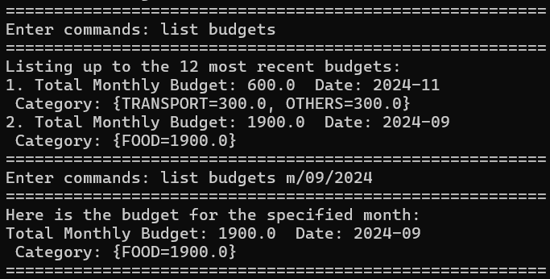

#### 4. List remaining budgets: `list remaining budget`
Show the budget remaining after deducting the [expenses](#1-adding-an-expense-add-expense) seperated by month and category.

If the total expenses in any category exceed the budget or if no budget is set, the remaining budget will display as a negative value, indicating an over-budget status.

Format: `list remaining budget`

Example of usage:

`list remaining budget`

Expected Usage of Feature:

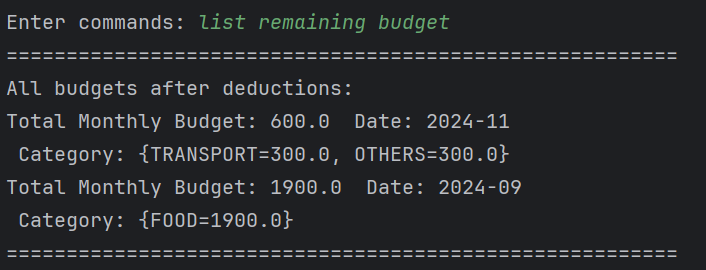

### Expense

---

#### 1. Adding an expense: `add expense`
Adds a new expense to the list of expenses.

Format: `add expense DESCRIPTION a/AMOUNT [d/DATE] [c/CATEGORY]`

* The `DESCRIPTION` is a short description of the expense. All words without a/c/d tag will be the description
* The `AMOUNT` is the amount of the expense. The amount can have up to 2 decimal points.
* The `DATE` (Optional) is the date of the expense in DD/MM/YYYY format. If date is not given, current date will be used
* The `CATEGORY` (Optional) is the category of the expense (FOOD, TRANSPORT, ENTERTAINMENT, EDUCATION, UTILITIES and OTHERS). If no category or invalid category is given, the default category OTHERS will be used

Example of usage:

`add expense air ticket a/123.45`

`add expense KFC lunch a/10.50 d/28/10/2024 c/FOOD`

Note:
* Try not to use `|` or `/` in the description. Refer to [descriptions](#1-descriptions) section on how to safely use `|` or `/` in the description.
* If multiple valid `amount`/`date`/`category` are entered, the last valid parameter will be used.
* The remaining budget, after deducting the added expense, will be displayed.
* If the expense causes the budget to be exceeded, a warning message will alert the user. 

Expected Usage of Feature:

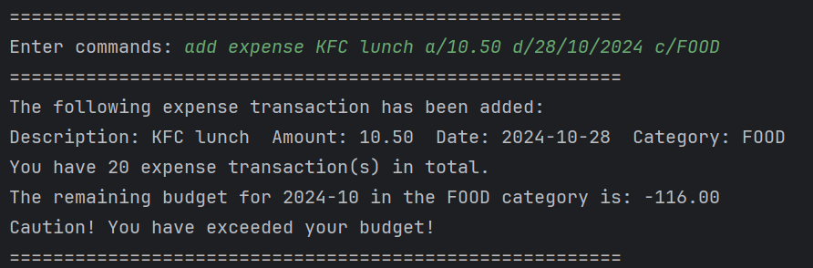

#### 2. Deleting an expense: `delete expense`
Delete an expense from the list of expenses.

Format: `delete expense INDEX`

* The `INDEX` is the index of the expense to delete.

Example of usage:

`delete expense 1`

Note:
* The remaining budget, after accounting for the deleted expense, will be displayed.
* If the budget is still less than 0, a warning message will alert the user.

Expected Usage of Feature:

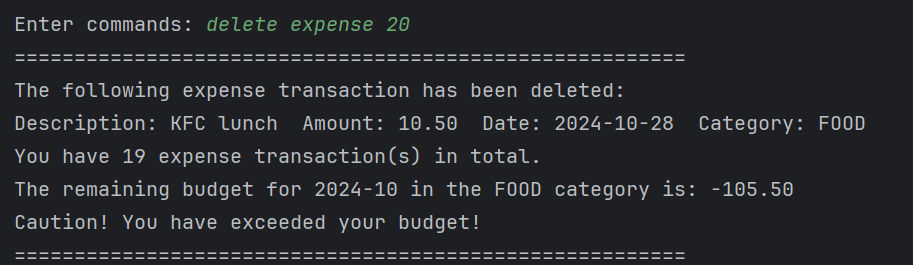

#### 3. List all expenses: `list expenses`
List the summary of expenses. User could additionally specify which summary type the would like to view.
A final line of total expenses based on summary type will be shown to users.

Format:
1. `list expenses`
2. `list expenses [m/MONTH]`
3. `list expenses [m/MONTH] [c/CATEGORY]`

* The `CATEGORY` (Optional) is the summary type to search for expenses with the specified category.
* The `MONTH` (Optional) is the summary type to search for expenses in the specified month in the format of`m/mm/yyyy`.

Note:
* Only inputs for months are accepted. Any input using date or year are not accepted.
* If any invalid identifiers are given (eg. y/YYYY or d/DD/MM/YYYY), it will ignore these identifiers.

Example of usage:
`list expenses`
`list expenses m/10/2024`
`list expenses m/10/2024 c/food`

Expected Usage of Feature:
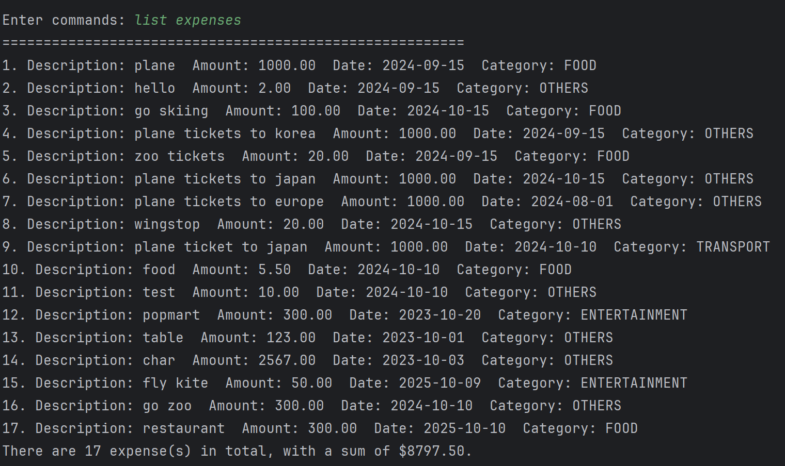
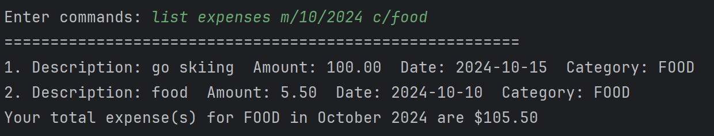

#### 4. Edit pre-existing expenses: `edit expense`
Edit a pre-existing expense entry details. Users can edit the category, amount and date of the expense field. 2 sets of
input will be required from the user.

Format:
1. `edit expense INDEX`
2. `[a/AMOUNT c/CATEGORY d/DATE]`

* The `INDEX` is the index of the desired expenses based on list expense that the user wants to edit.
* The `AMOUNT` (Optional) is the amount to be updated to.
* The `CATEGORY` (Optional) is the category to be updated to.
* The `DATE` (Optional) is the date to be updated to in the format of`d/dd/mm/yyyy`.

Note:
* For the second input, at least one of the field must be provided, else it returns back to main menu.

Example of usage:
1. `edit expense 3`
2. `a/100 c/food d/15/10/2024`

Expected Usage of Feature:
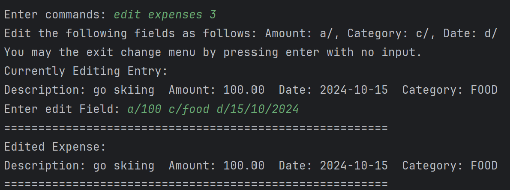

#### 5. Display Monthly Expenses Chart: `display monthly expenses`
Display a XY-Chart of your monthly expenses. The X-Axis will be the months of the year while the Y-Axis
is the total expenses for that particular month.

Format:
`display monthly expenses y/YEAR`

* The `YEAR` is the year of the expenses to be displayed
* The format of `YEAR` should be `YYYY`

Example of Usage:

`display monthly expenses y/2024`

Below is an example of the chart displayed.

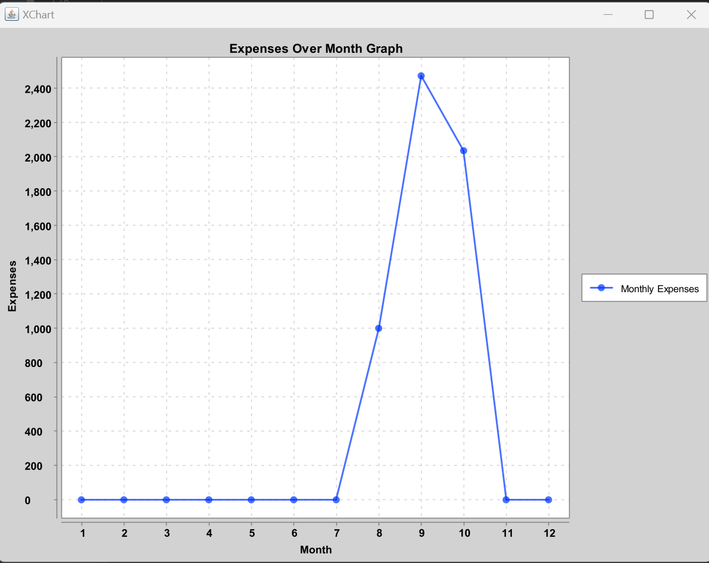

#### 6. Display Expenses for the Month with Categories Chart: `display expenses with categories`
Display a PieChart of your expenses for the month, which is sliced by categories. The legend of the PieChart is the
expenses for each category, and the percentage that each slice takes is on the PieChart itself.

Format:
`display expenses with categories m/MONTH`

* `MONTH` is the month of the expenses to be displayed
* `MONTH` should be in the form `MM/YYYY`

Example of Usage:

`display expenses with categories m/09/2024`

Below is an example of the chart displayed.

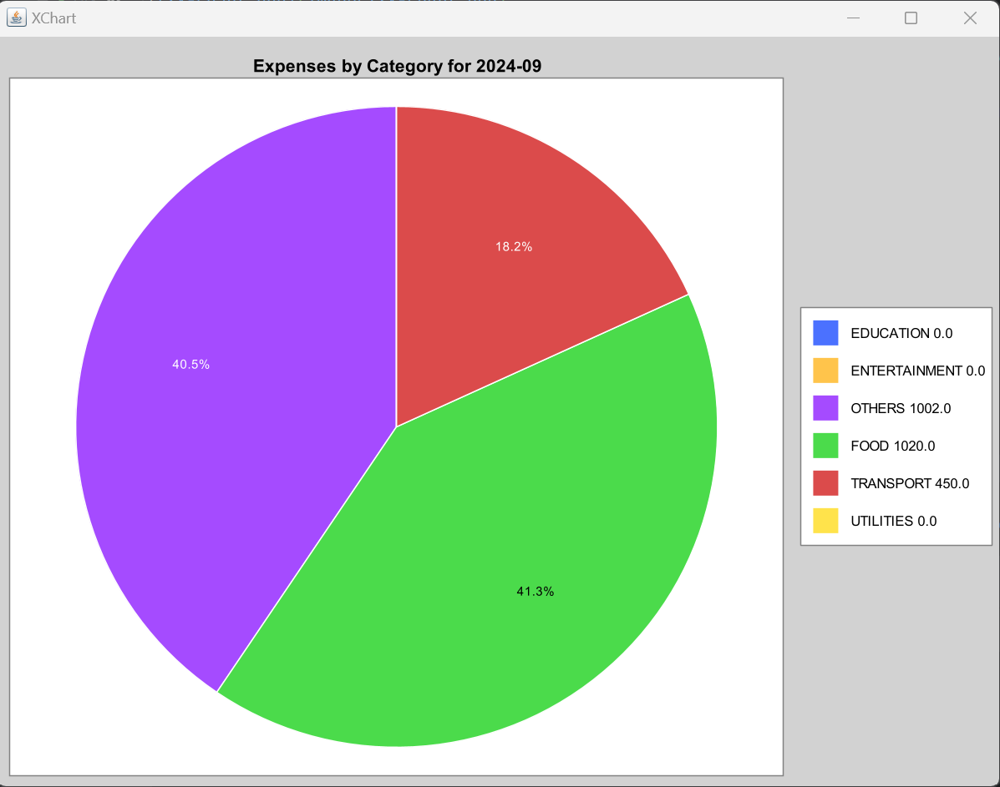

#### 7. Search Expense: `search expenses`
Displays the expense entries based on a certain keyword provided by the user. The relevant expense entries are then
filtered based on their description.

Format: `search expenses KEYWORD(S)`

* Displays expense entries with descriptions containing the keyword(s) provided by the user.
* If no keyword is provided by the user, an error message will show up, prompting the user to key in a valid keyword.
* If no expenses are found based on the keyword provided, a message indicating that no expense entries are found will
  show up.
* Filtering on the provided keyword(s) is case insensitive.

Example of usage:
1. `search expenses Japan`

Expected Usage of Feature: 
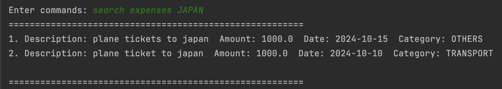

#### 8. Breakdown Expenses: `breakdown expenses`
Displays a breakdown of the user’s expenses, by category. The feature displays the total expenditure per category,
along with a percentage indicating the percentage of total expense spent per category.

Format: `breakdown expenses`

Example of usage:
1. `breakdown expenses`

Expected Usage of Feature: 
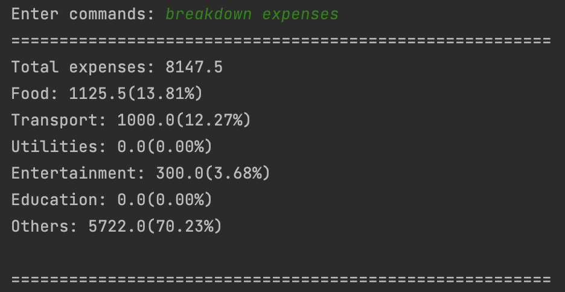

### Income

---

#### 1. Adding an income: `add income`
Adds a new income to the list of incomes.

Format: `add income DESCRIPTION a/AMOUNT [d/DATE]`

* The `DESCRIPTION` is a short description of the income. All words without a/c/d tag will be the description
* The `AMOUNT` is the amount of the income. The amount can have up to 2 decimal points.
* The `DATE` (Optional) is the date of the expense in DD/MM/YYYY format. If date is not given, current date will be used

Example of usage:

`add income tuition a/123.45`

`add income Tesla stock dividend a/10.50 d/28/10/2024`

Note:
* Try not to use `|` or `/` in the description. Refer to [descriptions](#1-descriptions) section on how to safely use `|` or `/` in the description.
* If multiple valid `amount`/`date` are entered, the last valid parameter will be used.

Expected Usage of Feature:

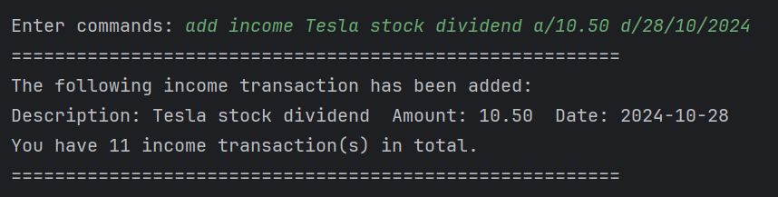

#### 2. Deleting an income: `delete income`
Delete an income from the list of incomes.

Format: `delete income INDEX`

* The `INDEX` is the index of the income to delete.

Example of usage:

`delete income 1`

Expected Usage of Feature:

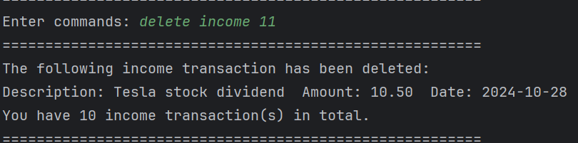

#### 3. Edit pre-existing incomes: `edit income`
Edit a pre-existing income entry details. Users can edit the amount and date of the expense field. 2 sets of input
will be required from the user.

Format:
1. `edit income INDEX`
2. `[a/AMOUNT d/DATE]`

* The `INDEX` is the index of the desired expenses based on list income that the user wants to edit.
* The `AMOUNT` (Optional) is the amount to be updated to.
* The `DATE` (Optional) is the date to be updated to, in the format of `d/dd/mm/yyyy`.

Note:
* For the second input, at least one of the field must be provided, else it returns back to main menu.

Example of usage:
1. `edit income 3`
2. `a/10000 d/15/10/2024`

Expected Usage of Feature:
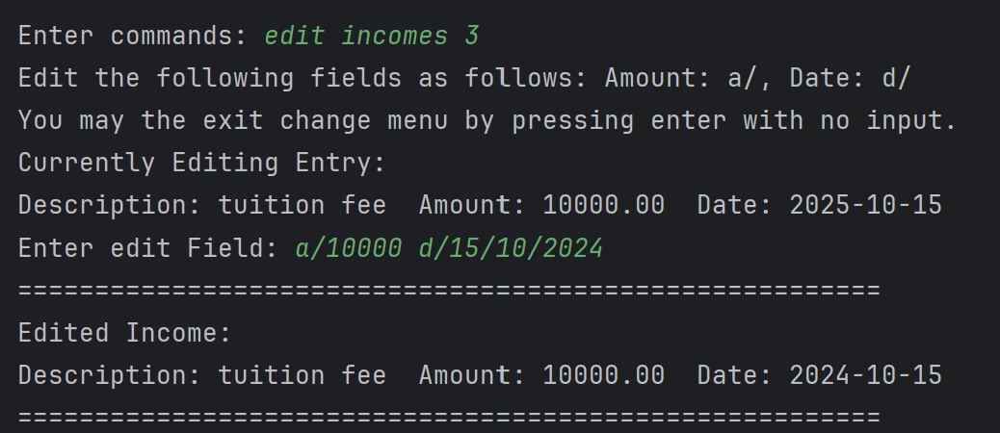

#### 4. List all incomes: `list incomes`
List the summary of incomes. User could additionally specify which summary type the would like to view.
A final line of total income based on summary type will be shown to users.

Format: `list incomes [m/MONTH]`

* The `MONTH` (Optional) is the summary type to search for incomes in the specified month in the format of`m/mm/yyyy`.

Note:
- Only inputs for months are accepted. Any inputs using date or year are not accepted.
- If any invalid identifiers are given (eg. y/YYYY or d/DD/MM/YYYY), it will ignore these identifiers.

Example of usage:
`list incomes`
`list incomes m/10/2024`

Expected Usage of Feature:
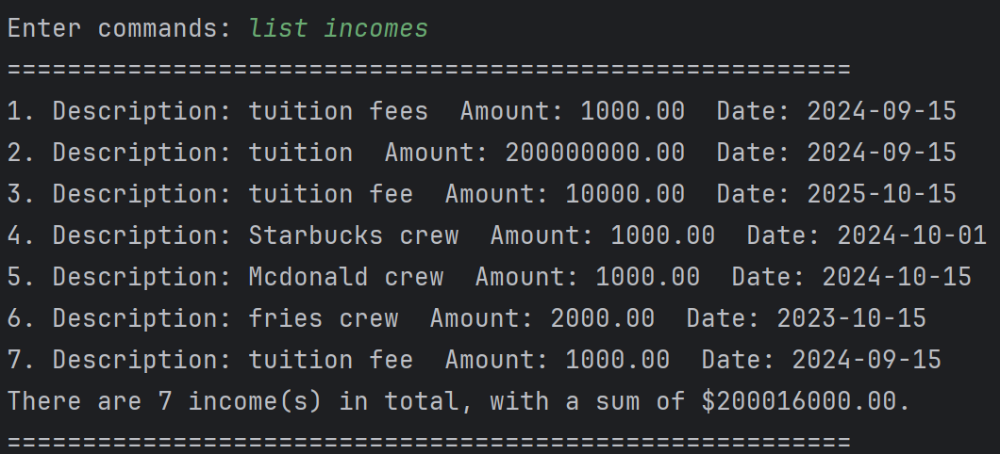
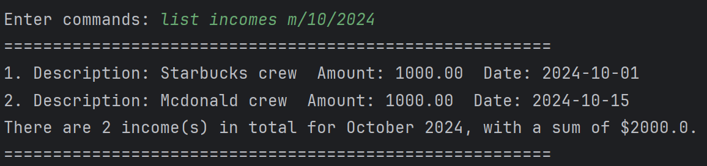

### Saving

---

#### 1. Display Savings: `display savings [m/]`
Displays the total savings of the user, calculated based on Total Income - Total Expense. User can choose to display
total savings, or a more detailed savings by month based on their input.

Format: `display savings [m/]`
* If m/ is not provided, total savings of the user is displayed.
* If there are no expense or income entries tracked by the app, total savings of 0 will be displayed. 

Examples of usages:
1. `display savings m/`
2. `display savings`

Expected Usage of Feature: `display savings m/`
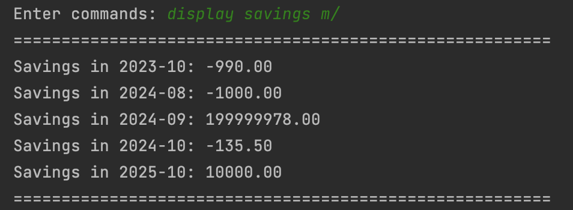

Expected Usage of Feature: `display savings`
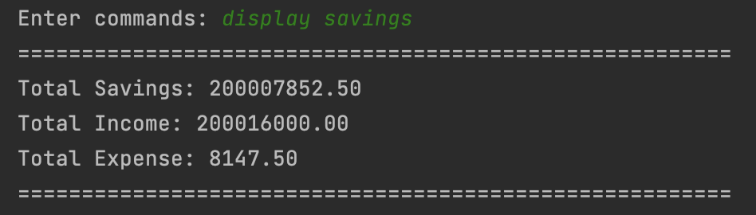

### Income Spent

---

#### 1. Display Income Spent: `display income spent`
Displays the percentage of income spent for the specified month. Spending only includes total expenses of the month.

Format: `display income spent [m/MONTH]`
* The MONTH (Optional) is the month of the budget in MM/YYYY format. If month is not given, current month will be used.

Examples of usages:
1. `display income spent`
2. `display income spent m/10/2024`

Expected Usage of Feature:  
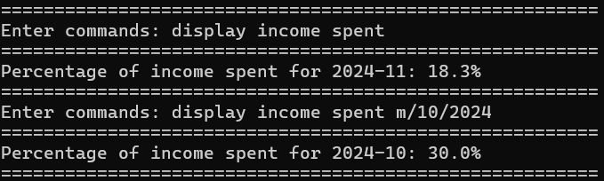

### Miscellaneous

---

#### 1. Exit Program: `bye`

Exits the program and save automatically.

Format: `bye`

#### 2. Help Sheet: `help`

Prints the list of commands for the user.

Format: `help`

## User Warnings

---

### 1. Descriptions
If the description contains words that start with `a/` or `d/` or `c/`, use capital letters (`A/` or `B/` or `C/`) to prevent invalid error

For features that requires descriptions, avoid using `|` for description as there can be some unintended results.  
E.g. Taking this command as example: `add expense hi | Bye a/100 d/10/10/2026`.  
This will create a warning as shown below next time the program is started up: 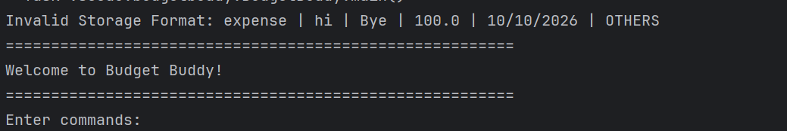

Users do not need to worry as Storage will automatically ignore and delete the wrongly formatted line, along with
giving a warning to the user, so that they are aware in the future.

The feature will continue to work as intended if the input is `add expense hi|Bye a/100 d/10/10/2026`.

## FAQ

---

**Q**: How do I transfer my data to another computer?

**A**: Copy the BudgetBuddy.txt created under the data folder under the same directory as your JAR file. Transfer the .txt
file to the other computer and replace it with the new .txt file created by your other computer.

**Q**: What if some of my lines in my file has the wrong formatting?

**A**: BudgetBuddy automatically skip lines that are corrupted in the data .txt file, so the program will not crash.
To fix the corrupted line, you can either edit the data file yourself to correct the format, or simply delete the line
and execute the command in the JAR file again.

**Q**: Can I add or create my own category type?

**A**: As of the current version, creating own category type is currently **not** supported. All features that requires
a category will be grouped as `OTHERS` if no category is provided.o

**Q**: What would the PieChart show if I have no expenses for the month when I am using `display expenses with categories`?

**A**: The PieChart will just be empty with the Legend showing that value of all categories to be 0.

**Q**: What would the XY-Chart show if I have no expenses for some months of the year when I am using `display monthly expenses`?

**A**: The value at that particular month will just be 0.

## Command Summary

---

### Expense

- **Add Expense**: `add expense DESCRIPTION a/AMOUNT [d/DATE] [c/CATEGORY]`
- **Delete Expense**: `delete expense INDEX`
- **List Expenses**: `list expenses [c/CATEGORY m/MONTH]`
- **Edit Expense**:
  1. `edit expense INDEX`
  2. `[a/AMOUNT c/CATEGORY d/DATE]`
- **Display Monthly Expenses Chart**: `display monthly expenses y/YEAR`
- **Display Expenses with Categories Chart**: `display expenses with categories m/MM/YYYY`
- **Search Expenses**: `search expenses KEYWORD(S)`
- **Breakdown Expenses**: `breakdown expenses`

### Income

- **Add Income**: `add income DESCRIPTION a/AMOUNT [d/DATE]`
- **Delete Income**: `delete income INDEX`
- **Edit Income**:
  1. `edit income INDEX`
  2. `[a/AMOUNT d/DATE]`
- **List Incomes**: `list incomes [m/MONTH]`

### Budget

- **Add Budget**: `add budget a/AMOUNT [m/MONTH] [c/CATEGORY]`
- **Deduct Budget**: `deduct budget a/AMOUNT [m/MONTH] [c/CATEGORY]`
- **List Budgets**: `list budgets [m/MONTH]`
- **List Remaining Budget**: `list remaining budget`

### Saving

- **Display Savings**: `display savings [m/]`

### Income Spent

- **Display Income Spent**: `display income spent [m/MONTH]`

